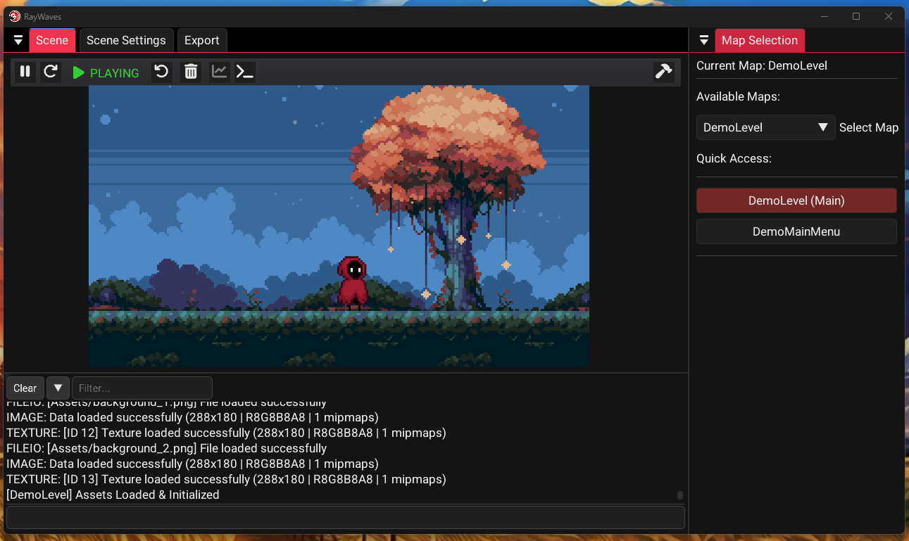

<div align="center">
  
  <h1>RayWaves Game Engine</h1>
  <p><i><b>Where your code changes flow like waves 🌊</b></i></p>
  <p>
    <a href="#-quick-start">🚀 Quick Start</a> •
    <a href="#-features">✨ Features</a> •
    <a href="#-development-workflow">🎮 Workflow</a> •
    <a href="#-documentation">📚 Docs</a>
  </p>
</div>

<br>

**RayWaves** is a lightweight, **code-first game engine** built on **Raylib**. It's designed for developers who love writing code but hate restarting their game to see changes. 

With our **hot-reloading magic**, you can tweak movement speeds, adjust physics, or even add new gameplay mechanics—all while the game is still running! 

---

## ✨ Features

- **🔥 Limitless Hot-Reloading**  
  Edit your C++ code and see the results in **~0.5 seconds**. No restarting. No lost state. Just flow.

- **🎮 Pure Raylib Power**  
  No proprietary scripting languages or complex ECS layers. It's just you and standard C++ Raylib code.

- **🎨 Visual Editor**  
  A sleek, ImGui-based editor with a file browser, asset management, and performance tools built right in.

- **🗺️ Smart Map System**  
  Effortlessly switch between levels or scenes using our intuitive `MapManager`.

- **📦 One-Click Distribution**  
  Pack up your entire engine and game into a standalone zip file ready for your team or players.

---

## 🖼️ See It In Action

### 🛠️ Live Development

*Design levels, tweak particles, and switch maps instantly in the visual editor.*

### 📤 Easy Exporting

*Generate standalone game executables with your custom naming and resolution settings.*

---

## 🚀 Quick Start

### 🔧 For Engine Developers
*Use these instructions if you want to **modify the engine source code itself** (e.g. `main.exe`).*

1. **Open your terminal** (Developer Command Prompt for VS recommended).
2. **Build the engine:**
   ```powershell
   cmake --preset x64-debug
   cmake --build out/build/x64-debug --config Debug --target main
   ```
3. **Launch the editor:**
   ```powershell
   out/build/x64-debug/main.exe
   ```

> **Note:** If you are just making games, you don't need to rebuild `main.exe`.

### 🎮 For Game Developers
*Use these instructions if you want to **make games** using RayWaves.*

👉 **[Read the Game Developer Guide](Documentation/README_DISTRIBUTION.md)**

Start here to learn how to:
- Run the engine (`editor.exe`)
- Create levels and write game logic
- Use hot-reloading for gameplay code
- Export your game

---

## 🎮 Development Workflow

### 🔧 Engine Development
1. **Launch the Editor** (`main.exe`).
2. **Modify engine internals** in `Game/`, `Editor/`, or `Engine/`.
3. **Rebuild the engine** using CMake.
---

## 🗺️ Adding Your Own Maps

Creating a new level is as simple as inheriting from `GameMap`.

**1. Create a class (`MyLevel.h`):**
```cpp
class MyLevel : public GameMap {
    void Update(float deltaTime) override {
        if (IsKeyDown(KEY_SPACE)) Jump();
    }
    void Draw() override {
        DrawText("Hello World!", 100, 100, 20, WHITE);
    }
};
```

**2. Register it (`RootManager.cpp`):**
```cpp
s_GameMapManager->RegisterMap<MyLevel>("Level_1");
```

**3. Switch to it:**
```cpp
// From anywhere in your code
RequestGotoMap("Level_1");
```

---

## 📦 Sharing Your Game

Want to send your game to a friend? Or maybe distribute the engine to your team?

Simply run:
```cmd
Distribution\create_distribution.bat
```

This generates a `dist/` folder with everything they need:
- `app.exe` (The game/editor)
- `GameLogic.dll` (The moddable code)
- All headers, scripts, and assets.

---

## 📚 Learn More

- **[API Reference](Documentation/API_REFERENCE.md)** - Detailed class documentation.
- **[Developer Guide](Documentation/DEVELOPER_GUIDE.md)** - Best practices and patterns.
- **[Particle System](Documentation/PARTICLE_SYSTEM_GUIDE.md)** - Creating cool visual effects.
- **[Troubleshooting](Documentation/TROUBLESHOOTING.md)** - Fix common issues.

---

## 💡 Top Tips

- **Files:** Use the built-in File Explorer to browse assets.
- **Reset:** Hit the **Restart** button in the toolbar if you want to force a full reload.
- **Performance:** Toggle the **Performance Overlay** (sales chart icon) to check your FPS and frame times.
- **Modes:** 
  - `main.exe` = Editor & Hot-Reloading
  - `game.exe` = Standalone Runtime (Pure Gameplay)

---

<div align="center">
  <b>Happy Coding! 💜</b>
</div>
